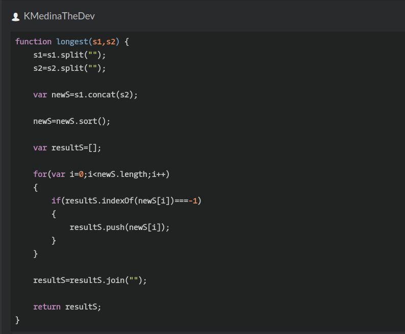

## CodeWars Challenge- 5

Description:
Take 2 strings s1 and s2 including only letters from ato z. Return a new sorted string, the longest possible, containing distinct letters,

each taken only once - coming from s1 or s2.

*Examples Given:*
1. a = "xyaabbbccccdefww" b = "xxxxyyyyabklmopq" longest(a, b) -> "abcdefklmopqwxy"

2. a = "abcdefghijklmnopqrstuvwxyz" longest(a, a) -> "abcdefghijklmnopqrstuvwxyz" rowSumOddNumbers(2); // 3 + 5 = 8

## Languages Used

1. JavaScript

## Arriving to the solution:

First, I knew I had two parameters including letters, a string object, and so I used the split method to split the object into an array of strings and separate the string into substrings. Then I created a new variable to hold the split values of both strings being passed in, newS. *By using the concat method I can concatenate the string argument with the string that is calling the concat method, this method is also useful if the argument being passed is not of the type string because it will convert the argument to string values before concatenating by default.*

Using the sort method I sort the concatenated string, in the array, using the default Unicode code points. I then introduce a new variable, an empty array. At this point it is time to check for the maximum length the string can be without repeating letters and so I use a for loop with a nested if statement that uses the empty array created, resultS and calls the method indexOf with newS[i] as the argument, iterating through the array-like objects, pushing the letter that is not repeated, and creating the new string-like object, which is the longest possible string containing distinct letters, each letter taken only once - coming from s1 or s2.

Once the new array has been created it pushes to the new string of the array-like object , lastly I use the join method to join the array into a string and then return the string. 
